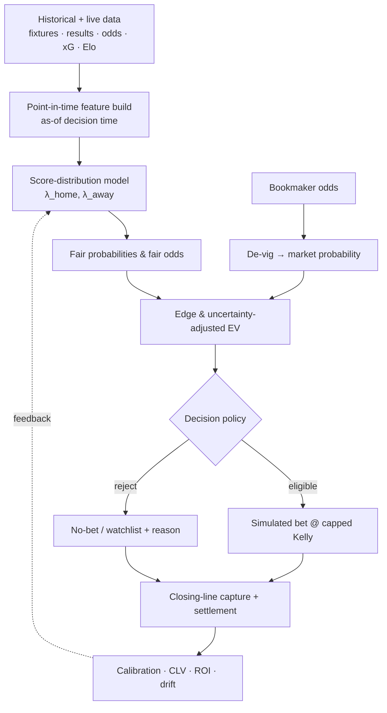
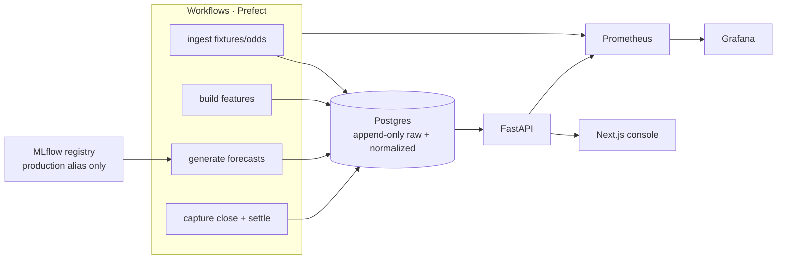

# GoalLine — Architecture

> **Milestone 1 needs none of this.** Phase 1 is a Python package plus an evaluation notebook running off cached CSV/Parquet. The architecture below is the *target* state (Phase 3+), recorded so the build has a destination. Do not stand up these services until there is a signal worth serving (ADR-0002, ADR-0004).

## Logical flow (the decisioning loop)

This loop is the whole product. Note the two feedback channels that ADR-0001 elevates: **closing-line capture** (CLV, available at kickoff) and **settlement** (realized P/L, the lagging demo).

## Target service topology (Phase 3+)

## Component responsibilities

| Component | Responsibility | Phase |
|---|---|---|
| `ml/` package | Model, calibration, evaluation, walk-forward harness | 1 |
| Ingestion workflows | Pull fixtures/results/odds/xG, validate, store immutably | 2 |
| Feature build | Point-in-time as-of features; leakage tests | 2 |
| Forecast service | Load production model, price markets, de-vig, EV, apply decision policy | 2–3 |
| Postgres | Append-only raw snapshots + normalized + forecasts/settlements (see `data-model.md`) | 3 |
| MLflow | Experiment tracking + registry; FastAPI loads only the `production` alias | 3 |
| FastAPI | Serve signals, match detail, monitoring, review actions | 3 |
| Next.js console | Market scan · match detail · review queue · monitoring | 4 |
| Prefect | Orchestrate the recurring loops | 5 |
| Prometheus + Grafana | Operational / model / decision-quality monitoring | 5 |

## Premature-until-justified (defer)

Redis, object storage, reverse proxy, and a staging environment are **not** justified in V1. Add Redis only when forecast read-latency demands a cache; object storage only when MLflow artifacts outgrow local/Postgres; a reverse proxy only when something is publicly exposed. Recording the "no" is as valuable as the "yes" (ADR ethos).
